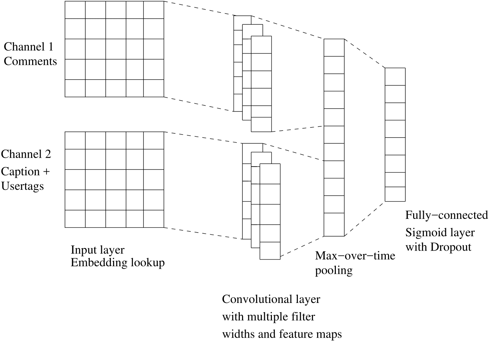
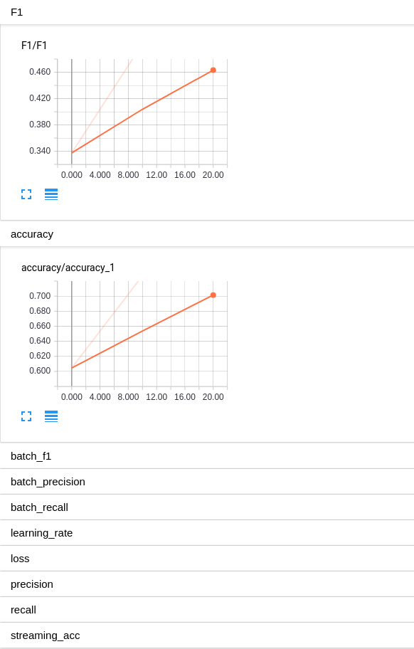
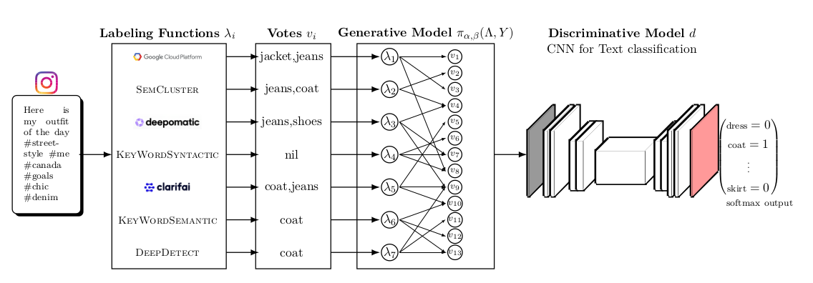
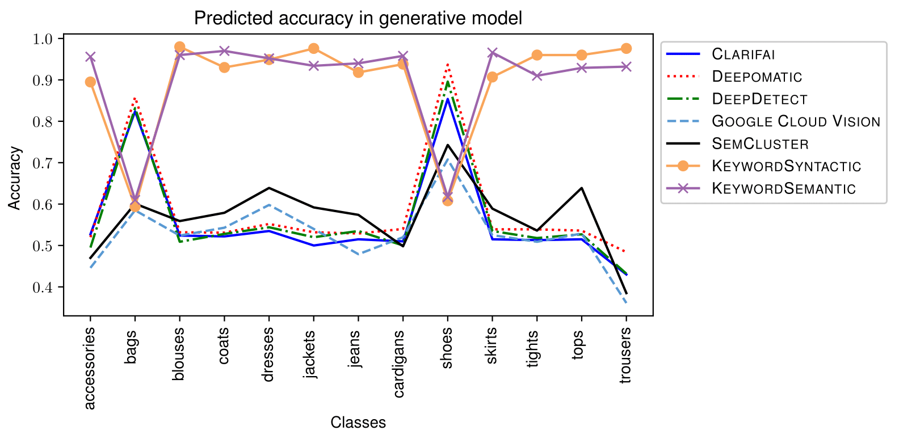

# Weakly Supervised Text Classification

## Overview

- `train.py` CNN for multi-class multi-label text classification using binary or probabilistic labels, pre-trained or random initialized word embeddings, using single channel or multi-channel input.

- `pre_process.py` Script for preprocessing the data prior to training the classifier, used by `train.py`à

- `model_serving.py` REST server with flask to serve a trained model

## `train.py`

CNN for multi-class multi-label text classification

### Model



### Usage

#### Example commands

##### Start training
```bash
python train.py \
--featurestrain "./data/cleaned/train/features.csv" \
--labelstrain "./data/cleaned/train/labels.csv" \
--featurestest "./data/cleaned/test/features.csv" \
--labelstest "./data/cleaned/test/labels.csv" \
--maxdocumentsize 2000 \
--testsplit 0.1 \
--outputvocabularyfile "./vocab/vocab.csv" \
--epochs 10 \
--batchsize 256 \
--vectordim 300 \
--learningrate 0.01 \
--dropoutkeepprob 0.7 \
--filtersizes 3 4 5 \
--numfilters 128 \
--l2reglambda 0.0 \
--output "./results"
--maxiterations 1000000000
--preprocess
--verbose
--generative
```

##### Example output with mock data
```bash
python train.py --featurestrain "./data/cleaned/train/features.csv" --labelstrain "./data/cleaned/train/labels.csv" --featurestest "./data/cleaned/test/features.csv" --labelstest "./data/cleaned/test/labels.csv" --maxdocumentsize 2000 --outputvocabularyfile "./vocab/vocab.csv" --epochs 10 --batchsize 1 --vectordim 300 --learningrate 0.1 --dropoutkeepprob 0.7 --filtersizes 3 4 5 --numfilters 128 --l2reglambda 0.0 --output "./results" --maxiterations 100000 --preprocess --testsplit 0.3
cleaned features len: 10
cleaned features len: 10
Vocabulary Size: 81
Train/Dev split: 7/3
#########     epoch: 1 , iteration: 0, dev f1: -1     ##########
#########     epoch: 1 , iteration: 10, dev f1: 1.0   ##########
#########     epoch: 1 , iteration: 20, dev f1: 1.0   ##########
#########     epoch: 1 , iteration: 30, dev f1: 1.0   ##########
#########     epoch: 1 , iteration: 40, dev f1: 1.0   ##########
....
....
....
```
##### Tensorboard

*Clear  tensorboard*:
```bash
rm -rf results/tensorboard/test/*
rm -rf results/tensorboard/train/*
```
*Start new session*
```bash
tensorboard --logdir=results/tensorboard/train/
tensorboard --logdir=results/tensorboard/test/ --port=6007
```

#### Options

| Parameter-name               | Description                                                                                                      |
| -----                        | -----------                                                                                                      |
| -ftr --featurestrain         | path to input train features                                                                                     |
| -ltr --labelstrain           | path to input train labels                                                                                       |
| -fte --featurestest          | path to input test features                                                                                      |
| -lte --labelstest            | path to input test labels                                                                                        |
| -md  --maxdocumentsize       | max document size                                                                                                |
| -tp --testsplit              | test split                                                                                                       |
| -ovf --outputvocabularyfile  | path to where to save the vocab                                                                                  |
| -e --epochs                  | number of epochs to train                                                                                        |
| -bs --batchsize              | batch size for training                                                                                          |
| -vd --vectordim              | word vector dimension                                                                                            |
| -lr --learningrate           | learningrate                                                                                                     |
| -dkb --dropoutkeepprob       | dropout keep probability                                                                                         |
| -fs --filtersizes            | filtersizes                                                                                                      |
| -nf --numfilters             | number of filters                                                                                                |
| -l2r --l2reglambda           | lambda factor term for L2 regularization                                                                         |
| -o --output                  | folder to save results                                                                                           |
| -hr --hyperandom             | boolean flag, whether to run hyperparameter tuning with random search                                            |
| -hg --hypegrid               | boolean flag, whether to run hyperparameter tuning with grid search                                              |
| -pr --pretrained             | boolean flag, whether to use pretrained embeddings                                                               |
| -gen --generative            | boolean flag whether to use generative model and data programming to combine votes, otherwise uses majority vote |
| -vec --vectors               | path to pre-trained vectors                                                                                      |
| -mc --multichannel           | boolean flag, whether to run with multiple input channels                                                        |
| -ver --verbose               | boolean flag, whether to use verbose logging                                                                     |
| -pl --plot                   | boolean flag whether to plot results at the end                                                                  |
| -pp --preprocess             | boolean flag whether to do the data cleaning steps                                                               |

### Weak Supervision

We have used this model in a weak supervision pipeline





## `model_serving.py`

Script for serving a trained and frozen version of the model over RESTful API

### Usage

#### Example commands

##### Start the server
```bash
python model_serving
```

##### Test the server with CURL

```bash
curl -H "Content-Type: application/json" -X POST -d '{"text":"xyz"}' http://127.0.0.1:8009/
```

#### Example output

```bash
curl -H "Content-Type: application/json" -X POST -d '{"text":"coat love the coat where did you buy the coat please I need this coat and I also need thoes jeans nice jeans levis shoes<3 shoes shoes shoooes bag"}' http://127.0.0.1:8009/
{
  "execution_time": 0.02891397476196289,
  "softmax_output": {
    "all_accessories": 0.0,
    "bags": 1.0,
    "blouses_and_tunics": 0.0,
    "coats": 1.0,
    "dresses": 0.0,
    "jackets": 0.0,
    "jeans": 1.0,
    "jumpers_and_cardigans": 0.0,
    "shoes": 1.0,
    "skirts": 0.0,
    "tights_and_socks": 0.0,
    "tops_and_tshirts": 0.0,
    "trouser_and_shorts": 0.0
  },
  "word_missing_from_vocab": true
}
```
## Original CNN Reference

All the CNN networks in this repository are variants of Kim Yoon's CNN in [1]

### Convolutional Neural Networks for Sentence Classification 

[1](#Convolutional Neural Networks for Sentence Classification)

```
@article{DBLP:journals/corr/Kim14f,
  author    = {Yoon Kim},
  title     = {Convolutional Neural Networks for Sentence Classification},
  journal   = {CoRR},
  volume    = {abs/1408.5882},
  year      = {2014}
}
```

## References 

If using any of the code in this repsitory in your work or research, please cite: [2](TODO)

### Title

[2] TODO, [*TODO*](link)

```
@article{todo,
  title={TODO},
  author={TODO},
  journal={TODO},
  year={TODO}
}
```

## License

BSD 2-clause, see [LICENSE](./LICENSE)

## Author

Kim Hammar, [kimham@kth.se](mailto:kimham@kth.se)

