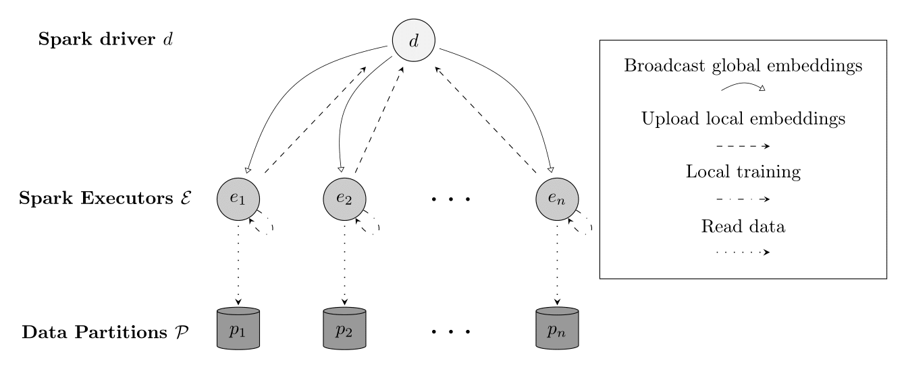
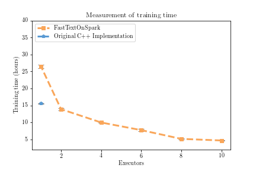
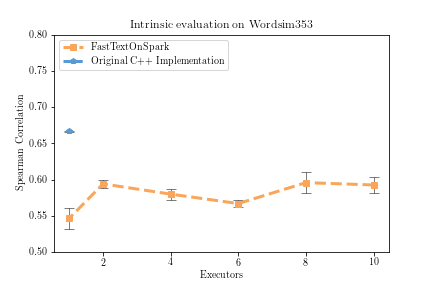

# FastTextOnSpark

FastTextOnSpark brings the FastText algorithm for training word embeddings to Spark clusters. It allows you to utilize clusters for training FastText word embeddings, as compared to the original C++ implementation that is bounded to a single machine.

Currently only supports the skip-gram model and hierarchical softmax output layer.

## How to run

1. **Build fat jar**
   - `$ sbt assembly`
2. **Run as spark-job**
   - submit to cluster or run locally

**Example local execution**
```
$SPARK_HOME/bin/spark-submit --class "limmen.fasttext_on_spark.Main" target/scala-2.11/fasttext_on_spark-assembly-0.1.0-SNAPSHOT.jar --input "/media/limmen/HDD/workspace/scala/fasttext_on_spark/data/wiki/clean.txt" --output "/media/limmen/HDD/workspace/scala/fasttext_on_spark/data/output" --cluster --partitions 2 --iterations 300 --dim 300 --windowsize 5 --algorithm "fasttext" --minn 3 --maxn 6 --mincount 1 --norm --bucket 10000
```

**Example cluster execution**

``` shell
$SPARK_HOME/bin/spark-submit \
    --master spark://limmen-MS-7823:7077 \
    --class "limmen.fasttext_on_spark.Main" \
    --conf spark.cores.max=8 \
    --conf spark.task.cpus=1 \
    --conf spark.executorEnv.JAVA_HOME="$JAVA_HOME" \
    --executor-memory 2g \
    --driver-memory 2g \
    /media/limmen/HDD/workspace/scala/fasttext_on_spark/target/scala-2.11/fasttext_on_spark-assembly-0.1.0-SNAPSHOT.jar --input "/media/limmen/HDD/workspace/scala/fasttext_on_spark/data/clean2_corpus.txt" --output "/media/limmen/HDD/workspace/scala/fasttext_on_spark/data/output" --cluster --partitions 2 --iterations 300 --dim 300 --windowsize 5 --algorithm "fasttext" --minn 3 --maxn 6 --mincount 1 --norm --bucket 10000 --verbose --average
```

## Parameters

| Parameter-name   | Description                                                                   |
| -----            | -----------                                                                   |
| --input          | [String] Path to input corpus                                                 |
| --output         | [String] Path to save output vectors                                          |
| --dim            | [Int] Dimension of vectors [100]                                              |
| --lr             | [Double] Learning rate for training [0.025]                                   |
| --partitions     | [Int] Number of Spark partitions [1]                                          |
| --iterations     | [Int] Number of iterations for training [1]                                   |
| --mincount       | [Int] Min frequency of words for training [5]                                 |
| --sentencelength | [Int] Maximum sentence length (otherwise split into multiple sentences [1000] |
| --windowsize     | [Int] Size of window of context words [5]                                     |
| --saveparallel   | [Boolean] If true, output is saved in partitioned format (faster) [false]     |
| --cluster        | [Boolean] If true spark is ran in cluster mode [false]                        |
| --minn           | [Int] Min length of n-grams 3                                                 |
| --maxn           | [Int] Max length of n-grams 3                                                 |
| --bucket         | [Int] Number of buckets for hashing n-grams [2000000]                         |
| --algorithm      | [String] Algorithm for trainning (word2vec | fasttext) [word2vec]             |
| --norm           | [Boolean] If true output vectors are first normalized with L2 norm [false]    |
| --average        | [Boolean] If true paritioned embeddings are averaged instead of summed        |
| --verbose        | [Boolean] If true logging is verbose [false]                                  |

## Architecture



## Benchmarks

See results in `./eval/benchmarks.csv`
See commands that were used for benchmarks to reproduce: `./eval/commands.txt`

Get the test dataset [here](https://www.dropbox.com/s/97f1y6ew2mvwhiv/clean_wiki.txt.tar.gz?dl=0).

The dataset were scraped from English wikipedia 2018-03-01 using the scripts provided at
[The FastText repo](https://github.com/facebookresearch/fastText)




## Features to Implement

- CBOW model
- Negative sampling
- Regular softmax
- Cache LOG computations

## Original FastText References

Cite [1](#enriching-word-vectors-with-subword-information) if using the FastText algorithm for learning word representations.

### Enriching Word Vectors with Subword Information

[1] P. Bojanowski\*, E. Grave\*, A. Joulin, T. Mikolov, [*Enriching Word Vectors with Subword Information*](https://arxiv.org/abs/1607.04606)

```
@article{bojanowski2016enriching,
  title={Enriching Word Vectors with Subword Information},
  author={Bojanowski, Piotr and Grave, Edouard and Joulin, Armand and Mikolov, Tomas},
  journal={arXiv preprint arXiv:1607.04606},
  year={2016}
}
```
## References

If using any of the code in this repsitory in your work or research, please cite: [2](TODO)

In this publication you can also find an evaluation of the system.

### FastTextOnSpark

[2] K.Hammar, [*TODO*](link)

```
@Unpublished{hammar2,
  author = 	 {Kim Hammar},
  title = 	 {Deep Text Mining of Instagram Data Using Word Embeddings and Weak Supervision},
  institution = {KTH, School of Information and Communication Technology (ICT)},
   school = {KTH, School of Information and Communication Technology (ICT)},
  note = 	 {in press}
}
```

## License

BSD 2-clause, see [LICENSE](./LICENSE)

## Author

Kim Hammar, [kimham@kth.se](mailto:kimham@kth.se)
