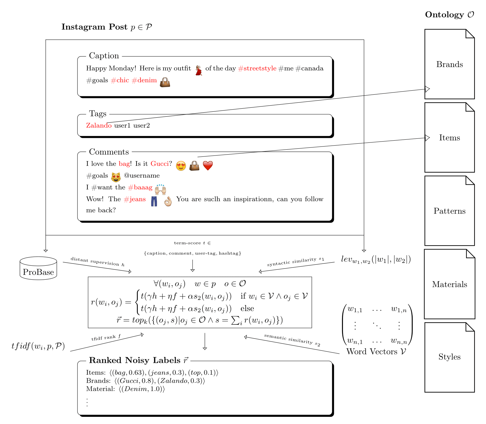

# Information Extraction Scripts

## Overview

- `fast_analysis.py` is a script for analyzing users, uses Preprocessor.py and InformationExtraction.py, uses Spark for distribution, uses a plethora of external APIs as distant supevision, and uses local semantic clustering of text

- `ie_eval.py` is a script for evaluating the information extraction system against ground truth labels. The evaluation supports comparison with baselines as well as extrinsic evaluation of word embeddings.  

## Pipeline for Information Extraction




## `fast_analysis.py`

### Usage

This script maps the input documents to the given domain data/ontology by using text analysis techniques such as clustering, it also uses distant supervision in the form of external APIs to classify the input images.

#### Example commands

##### Local

```bash
python fast_analysis.py \
--input data/sample_user.csv \
--conf conf/conf.json \
--output output \
--textanalysis \
--materials domain_data/material.csv \
--items domain_data/items.csv \
--styles domain_data/styles.csv \
--brands domain_data/companies.csv \
--patterns domain_data/patterns.csv \
--itemtopcategory domain_data/item_top_category.csv \
--probasebrands domain_data/probase_brands.csv \
--probasematerials domain_data/probase_materials.csv \
--vectors vectors/vectors.vec
```

##### Cluster execution
```bash
$SPARK_HOME/bin/spark-submit \
--master spark://limmen-MS-7823:7077 \
--py-files /media/limmen/HDD/workspace/fashion_rec/FashionRec/information_extraction/fast_analysis.py,/media/limmen/HDD/workspace/fashion_rec/FashionRec/information_extraction/InformationExtraction.py,/media/limmen/HDD/workspace/fashion_rec/FashionRec/information_extraction/deepomatic.py,/media/limmen/HDD/workspace/fashion_rec/FashionRec/information_extraction/dd_client.py,/media/limmen/HDD/workspace/fashion_rec/FashionRec/information_extraction/dd_bench.py \ \
--conf spark.cores.max=8 \
--conf spark.task.cpus=1 \
--conf spark.executorEnv.JAVA_HOME="$JAVA_HOME" \
--executor-memory 10g \
--driver-memory 5g \
/media/limmen/HDD/workspace/fashion_rec/FashionRec/information_extraction/fast_analysis.py --input data/sample_user.csv --output output/sample_user --conf ./conf/conf.json --textanalysis
```

See also 
```bash
./start_cluster
./run.sh
./stop.sh
```

### Resources

- `./domain_data` contains domain data and ontology-like data in plaintext format, it is used to classify the input text.
- `./vectors/vector.vec` should contain word embeddings of your choice to perform the text clustering, pre-trained fashion embeddings can be downloaded from [here](https://www.dropbox.com/s/97f1y6ew2mvwhiv/clean_wiki.txt.tar.gz?dl=0).
- `./conf/conf.json` configuration file, only necessary if you use all of the features in the analysis

#### Options

| Parameter-name         | Description                                                                   |
| -----                  | -----------                                                                   |
| -i --input             | folder where input documents are ["data"]                                     |
| -o --output            | folder where output documents are ["cleaned"]                                 |
| -pa --partitions       | [Number of Spark partitions [1]                                               |
| -c --conf              | path to confFile", ["./conf/conf.json"]                                       |
| -im --imagepath        | path to images, necessary if using google vision API                          |
| -g --google            | flag whether to use google vision api                                         |
| -dd --deepdetect       | flag whether to use deepdetect API                                            |
| -ca --clarifai         | flag whether to use clarifai API                                              |
| -dm --deepomatic       | flag whether to use deepomatic API                                            |
| -lk --liketkit         | flag whether to scrape liketkit links in the classification                   |
| -pa --partitions       | number of spark partitions                                                    |
| -ma --materials        | path to file with clothing materials/fabrics                                  |
| -it --items            | path to file with sub-categories of clothing items                            |
| -st --styles           | path to file with clothing styles                                             |
| -br --brands           | path to file with clothing brands                                             |
| -pat --patterns        | path to file with clothing patterns                                           |
| -itc --itemtopcategory | path to file with top-categories of items                                     |
| -pbr --probasebrands   | path to file with probase categories to match with brands                     |
| -pma --probasematerials| path to file with probase categories to match with materials/fabrics          |
| -vec --vectors         | path to file with word vectors                                                | 

## `ie_eval.py`

### Usage

This script maps the input documents to the given domain data/ontology by using text analysis techniques such as clustering, it also uses distant supervision in the form of external APIs to classify the input images.

#### Example commands

##### Local

```bash
python ie_eval.py \
--input data/sample_user.csv \
--output output \
--materials domain_data/material.csv \
--items domain_data/items.csv \
--styles domain_data/styles.csv \
--brands domain_data/companies.csv \
--patterns domain_data/patterns.csv \
--itemtopcategory domain_data/item_top_category.csv \
--probasebrands domain_data/probase_brands.csv \
--probasematerials domain_data/probase_materials.csv \
--vectors vectors/vectors.vec \
--testvectors conf/vectors.json \
--labels eval/annotations.json
```

### Resources

- `./domain_data` contains domain data and ontology-like data in plaintext format, it is used to classify the input text.
- `./vectors/vector.vec` should contain word embeddings of your choice to perform the text clustering, pre-trained fashion embeddings can be downloaded from [here](https://www.dropbox.com/s/97f1y6ew2mvwhiv/clean_wiki.txt.tar.gz?dl=0).
- `./conf/vetors.json` contains list of pre-trained vectors to perform extrinsic evaluatio on

#### Options

| Parameter-name             | Description                                                                   |
| -----                      | -----------                                                                   |
| -i --input                 | folder where input documents are ["data"]                                     |
| -o --output                | folder where output documents are ["cleaned"]                                 |
| -ma --materials            | path to file with clothing materials/fabrics                                  |
| -c --conf                  | path to confFile", ["./conf/conf.json"]                                       |
| -it --items                | path to file with sub-categories of clothing items                            |
| -st --styles               | path to file with clothing styles                                             |
| -br --brands               | path to file with clothing brands                                             |
| -pat --patterns            | path to file with clothing patterns                                           |
| -itc --itemtopcategory     | path to file with top-categories of items                                     |
| -pbr --probasebrands       | path to file with probase categories to match with brands                     |
| -pma --probasematerials    | path to file with probase categories to match with materials/fabrics          |
| -vec --vectors             | path to file with word vectors                                                | 
| -testvectors --testvectors | conf file with list of vectors to evaluate                                    |
| -lab --labels              | file location of labels                                                       |

### References 

If using any of the code in this repsitory in your work or research, please cite: [1](TODO)

In this publication you can also find an evaluation of the system. 

#### Title

[1] TODO, [*TODO*](link)

```
@article{todo,
  title={TODO},
  author={TODO},
  journal={TODO},
  year={TODO}
}
```

## License

BSD 2-clause, see [LICENSE](./LICENSE)

## Author

Kim Hammar, [kimham@kth.se](mailto:kimham@kth.se)