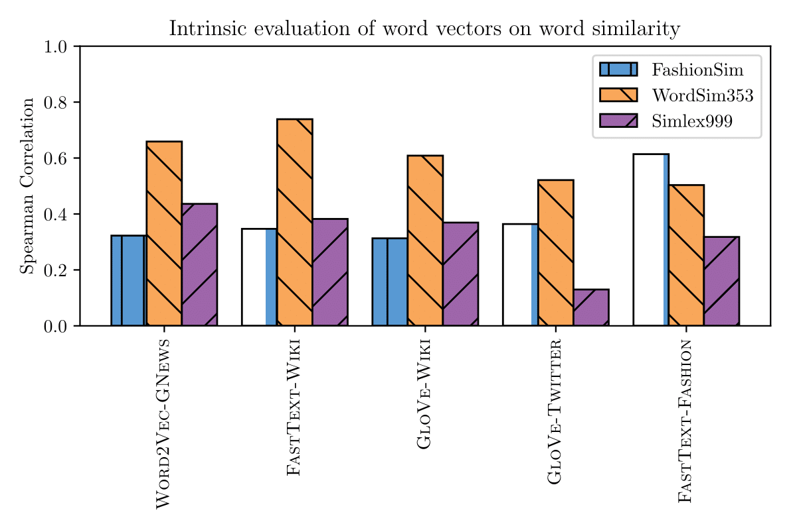
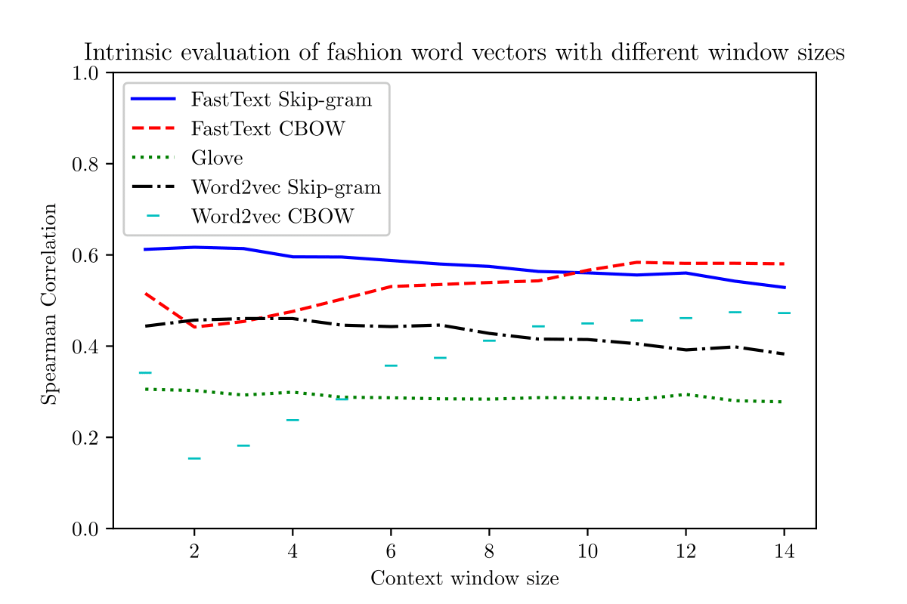
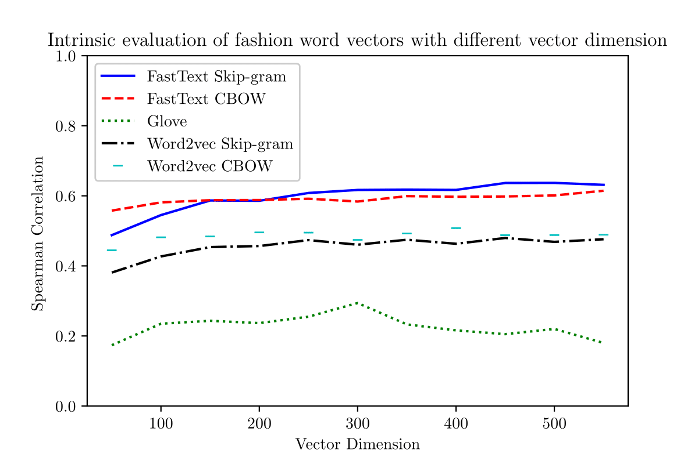
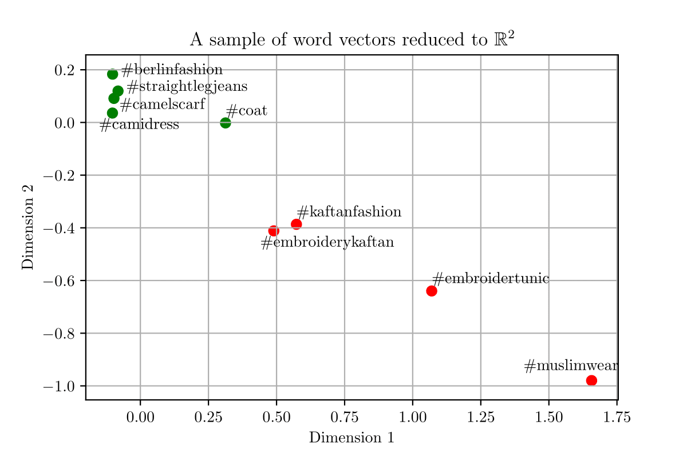

# Scripts for training/evaluating word embeddings

## Overview

- `pre_process_corpus.py`  A script for cleaning and normalizing a corpora to make it suitable to train word embeddings on
- `wordvecs.py` A script with various utilities for training and evaluating word embeddings

## `pre_process_corpus.py`

This script normalizes the input corpora in the following ways:

- Remove non-unicode characters
- Remove stopwords, usertags, urls
- Lower-case the text
- Tokenization with NLTK's TweetTokenizer
- Remove twitter pictures and other special tokens
- Remove URLs
- Lemmatization

In addition to the mentioned processing, the script also computes several statistics of the input corpora.

### Usage


#### Options

| Parameter-name   | Description                                                                   |
| -----            | -----------                                                                   |
| -i --input       | list of input corporas |
| -mc --mincount   | minimum frequency count of words  |
| -o --output      | output directory  |

#### Example commands

```bash
python pre_process_corpus.py --input "data/corpora/1/1.txt" "data/corpora/2/2.txt" --mincount 2 --output data
```

#### Output
- `<output-dir>/clean2_corpus.txt` - the final clean corpus
- `<output-dir>/corpora_stats.txt` - stats about each input corpora
- `<output-dir>/corpus_stats.txt` stats about the merged corpus
- `<output-dir>/raw_corpus.txt` the raw merged corpus

## `wordvecs.py`

Contains functions for training and evaluating word vectors such as:

- Vector training with Word2Vec, Glove, FastText
- Retrofitting trained vectors to some ontology 
- Evaluating vectors on the word similarity task, word analogy task and word does not match task
- Saves results of evaluation to .csv file

### Usage

Change `main()` function in the script based on what functions you want to run and then use command:

```bash
python wordvecs.py
```

After evaluation, depending on how you configured the script, results are written to `./results/eval/results.csv` in the format:

`analogies_synacc,analogies_semacc,analogies_overallacc,simlex999_pearson,simlex999_pearson_pvalue,simlex_999_spearman,simlex999_spearman_pvalue,simlex999_oov,wordsim353_pearson,wordsim353_pearson_pvalue,wordsim353_spearman,wordsim353_spearman_pvalue,wordsim353_oov,fashionsim_pearson,fashionsim_pearson_pvalue,fashionsim_spearman,fashionsim_spearman_pvalue,fashionsim_oov,dimension,context,model,algorithm,data,name`

## Intrinsic Evaluation







## Word Clustering




## Sample Instagram Fashion Vectors

Get the best performing embeddings trained on IG Fashion corpora through the links below:

| Algorithm | Corpora   | Dimension | Context Window Size | Model     | Link                                                                                                            |
| -----     | -----     |     ----- |               ----- | -----     | ---                                                                                                             |
| FastText  | Instagram |       300 |                   3 | Skip-gram | [fasttext_ig_300_3](https://www.dropbox.com/s/tvie2f8jtxcu4ca/fasttext_fashion_dim300_c3_skipgram.vec.zip?dl=0) |
| Word2vec  | Instagram |       300 |                  13 | CBOW      | [word2vec_ig_300_13](https://www.dropbox.com/s/zv82vnjh6v4aa3n/word2vec_fashion_dim300_c13_0.vec.zip?dl=0)      |
| Glove     | Instagram |       300 |                  12 | -         | [glove_ig_300_12](https://www.dropbox.com/s/ervmtrrx24zqkxf/glove_fashion_dim300_c12_-.vec.zip?dl=0)            |

## References 

If using any of the code in this repsitory in your work or research, please cite: [1](TODO)

In this publication you can also find an evaluation of the system. 

### Title

[1] TODO, [*TODO*](link)

```
@article{todo,
  title={TODO},
  author={TODO},
  journal={TODO},
  year={TODO}
}
```

## License

BSD 2-clause, see [LICENSE](./LICENSE)

## Author

Kim Hammar, [kimham@kth.se](mailto:kimham@kth.se)